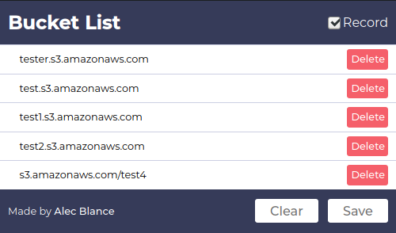

# S3BucketList v2.1

S3BucketList is a Chrome extension that records S3 Buckets found while browsing. 
This will be ported into Firefox as soon as they support service workers. 

## Installation
1. Download the S3BucketList zip
2. Extract 
3. Go to Google Chrome's Settings - icon > Tools > Extensions
4. Enable Developer Mode ( toggle button in top-right corner )
5. Click "Load unpacked" and locate the extracted zip from step 2
6. Browse

## Checklist 
- [ ] Filter
- [ ] New UI
- [ ] UI Bug fixes (scrolls to the top when deleting)
- [ ] Port to Firefox (will do if service workers will be supported)
- [ ] Performance boost

## Built with
 - HTML - Markup Language
 - Javascript - Programming Language

## Author
 - Alec Blance 
## Contributors
 - Almira Ruby Montalvo - Design
## Acknowledgements
 - [FreePik](https://www.flaticon.com/authors/freepik) - BucketList logo
## License
This project is licensed under the MIT License - see the [LICENSE](LICENSE) file for details

