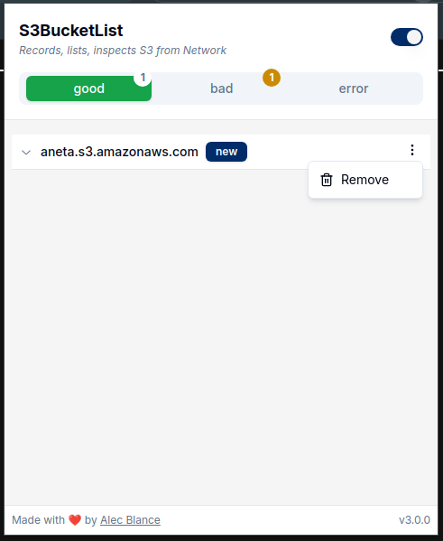

# S3BucketList

Search, lists, and checks S3 Buckets found in network requests while you are browsing.

&nbsp;&nbsp;
 
&nbsp;&nbsp;

## Features

- Filters S3Buckets
- Extract ACL permissions
- Download recorded buckets
- Manage recorded buckets
- Tab-specific bucket recording
- Unclaimed / Hanging / Vulnerable buckets

## Installation

#### Chrome

You can install this extension from the [Chrome Web Store](https://chromewebstore.google.com/detail/s3bucketlist/anngjobjhcbancaaogmlcffohpmcniki?authuser=0&hl=en) or:

1. Download from the [latest](https://github.com/AlecBlance/S3BucketList/releases) release.
2. Extract the downloaded zip file
3. On the top right of the Chrome browser, click the three dots.
4. Select `Extension > Manage Extensions`, and enable `Developer Mode`
5. Click `Load unpacked`, and look for the extracted zip file.

#### Firefox

You can install this extension from the [Firefox add-ons](https://addons.mozilla.org/en-US/android/addon/s3bucketlist/) or:

1. Download from the [latest](https://github.com/AlecBlance/S3BucketList/releases) release.
2. Extract the downloaded zip file
3. In your firefox browser, navigate to `about:debugging > This Firefox > "Load Temporary Addon"`
4. Select the `manifest.json` within the extracted zip file

## Build from source

1. Clone the repository, and navigate to the S3BucketList folder
2. Install [pnpm](https://pnpm.io/installation)
3. Do `pnpm i` to install the required modules
4. Do `pnpm zip` for chrome-compatible version or `pnpm zip:firefox` for firefox-compatible version.
5. A zip file will be created in the `dist/` folder
6. Follow the manual installation steps above on how to install the extension.
